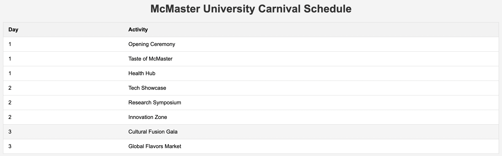
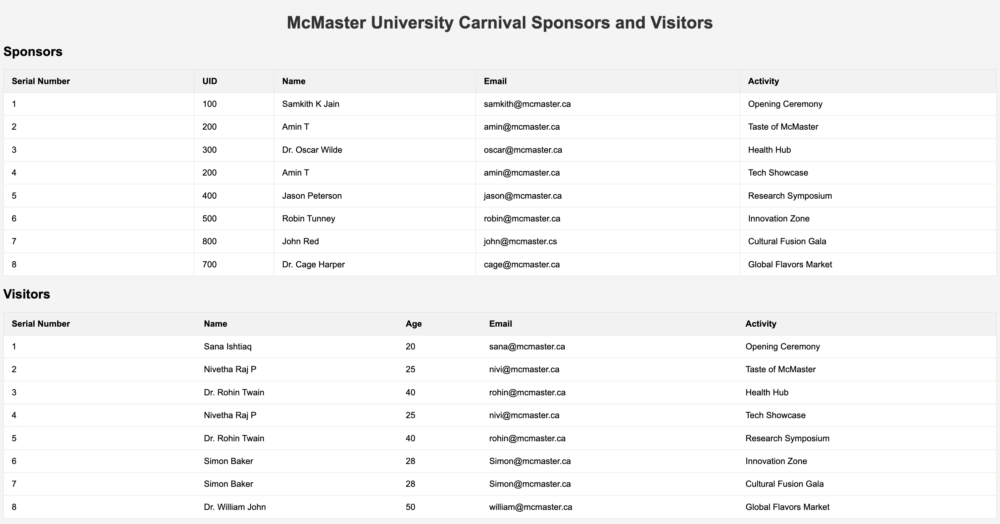

    <h1> CAS 703 - Software Design Project </h1>
    <h2> Winter 2024 McMaster University </h2>
    <h2> McMaster University </h2>

## Table of Contents

- [Introduction](#introduction)
- [Meta-modelling](#metamodelling)
  - [Class Diagram](#class-diagram)
  - [Assumptions](#assumptions)
  - [Alternatives](#alternatives)
- [Concrete Syntax & Editor](#concrete-syntax--editor)
  - [Semiotic Clarity](#semiotic-clarity)
  - [The GMF Editor](#the-gmf-editor)
  - [Advantages](#advantages)
  - [Disadvantages](#disadvantages)
- [Validation](#validation)
- [Model to Text Transformation](#model-to-text-transformation)
- [Software and Dependencies](#software-and-dependencies)
- [References](#references)
- [Contributors](#contributors)

## Introduction
Welcome to the world of the Carnivals, a vibrant celebration that captivates hearts and sparks joy. Carnivals are festive gatherings that draw people from far and wide, offering a range of entertainment and excitement. In the spirit of embracing this joyful atmosphere, a domain-specific language using Epsilon has been designed to capture the essence of Carnivals through meta-modelling.

Our journey begins with designing the ECore meta-model for our Carnival using Emfatic, carefully selecting classes, relationships, and multiplicities to capture the essence of our celebration. After ensuring the model's validity and registering it, we turn to Eugenia to generate the boilerplate code for the Graphical Modeling Framework (GMF). With a keen focus on clarity, we establish a direct correlation between model constructs and graphical symbols, ensuring semiotic clarity. With our newly minted GMF-based editor, we dive into creating our model - the McMaster Carnival! Moving forward, we employ the Epsilon Validation Language to add robust constraints, ensuring its integrity and correctness. Finally, leveraging the power of Epsilon Generative Languages, we generate vibrant HTML pages.

Our goal is not only to develop a comprehensive meta-model for carnivals but also to provide insights into the practical applications of meta-modeling in software engineering contexts. By engaging in this project, you will gain hands-on experience with metamodeling techniques and deepen your understanding of eclipse based development environments.

## Meta-modelling
To model the dynamic aspects of the Carnival, emfatic has been used to create the ECore model. The design encompasses fundamental elements that define the carnival experience, ranging from diverse activities to enthusiastic participants.

### Class Diagram
**Figure 1** illustrates the ECore meta-model for the Carnival
<figure>
  
  <figcaption style="text-align:center;">Figure 1: Class Diagram</figcaption>
</figure>

1. **NamedElement:** An abstract class serving as the foundation for naming various elements within the carnival.
2. **Activity:** An abstract class capturing the diverse range of activities present at the carnival.
3. **Event:** A type of activity open to all carnival attendees.
4. **Booth:** A type of activity with limited resources, offering unique experiences.
5. **Participant:** An abstract class encompassing the different individuals engaged in the carnival.
6. **Visitor:** Class representing attendees who join the carnival as visitors, embracing the fun-filled spirit.
7. **Sponsor:** Class representing folks who actively contribute as sponsors, enhancing the carnival experience.
8. **CarnivalDay:** Class defining a specific day within the carnival, comprising a variety of engaging activities.
9. **Carnival:** Base class encapsulating the entire carnival celebration, composed of carnival days and diverse participants.

This metamodelling structure forms the framework for a comprehensive representation of the Carnival, offering flexibility and customization based on the unique characteristics of your specific carnival celebration. Additional details, associations, and constraints can be incorporated to tailor the model to your project's requirements.

### Assumptions
- The sponsors will assume responsibility for event and booth management, thereby eliminating the need for additional helpers or staff.
- Booths remain open continuously throughout the day or until their stocks are depleted.
- Each event takes place at a distinct time during the day, and no two events can happen simultaneously on the same day.

### Alternatives
In the alternate design of the Carnival meta model within the context of ECore modeling, the introduction of the "Helper" EClass would enhance the existing structure by providing a dedicated representation for staff or assistants involved in event and booth management tasks. This new EClass would establish a clear distinction between sponsors and the individuals responsible for executing various operational aspects of the Carnival.

The "Helper" EClass would contain attributes defining the roles, skills, and availability of each staff member. Additionally, it would have references to other relevant classes within the meta model, such as events or booths, to indicate the specific areas where helpers are deployed. These references would enable efficient navigation and management of helpers within the Carnival ecosystem.

By introducing the "Helper" EClass, the meta model gains added flexibility and granularity in representing the organizational structure and operational dynamics of the Carnival. Sponsors can now have a dedicated team of helpers under their purview, allowing for more effective coordination and delegation of tasks. However, this addition may necessitate adjustments to the concrete syntax and navigation paths within the model to accommodate the new class and its relationships effectively. Nonetheless, the inclusion of helpers enhances the overall functionality and realism of the Carnival meta model.

## Concrete Syntax & Editor

### Semiotic Clarity 
In our Carnival meta model design, achieving semiotic clarity was important to ensure that the graphical representations effectively conveyed the underlying model constructs. We first established a one-to-one mapping between model elements and their graphical symbols, ensuring each entity, such as sponsors, events, and helpers, was distinctly and clearly represented. (Refer to **Figure 2**: Semiotic Clarity for an illustration of this mapping.)

<figure>
  
  <figcaption style="text-align:center;">Figure 2: Semiotic Clarity</figcaption>
</figure>

### The GMF Editor
We employed Eugenia, an Eclipse-based tool built on the Graphical Modeling Framework (GMF), to create the Concrete Syntax and Editor The Eugenia generated editor was run as a plugin on Eclipse, using which we created a sample carnival model illustrated in **Figure 3** below. The resulting graphical editor provides stakeholders with an intuitive and easily interpretable visual representation of the meta model's structure and relationships.

<figure>
  
  <figcaption style="text-align:center;">Figure 3: GMF Editor / Model Instance</figcaption>
</figure>

### Advantages
Using GMF (Graphical Modeling Framework) for the Carnival meta-model offers several advantages. One major advantage is its ability to provide a customizable and visually appealing graphical editor tailored specifically to the domain of the Carnival meta-model. This enables stakeholders to intuitively create, edit, and visualize the model's elements and relationships, enhancing understanding and collaboration. Additionally, GMF automates much of the underlying infrastructure required for creating graphical editors, saving time and effort in development.  

### Disadvantages
The alternative design incorporating a set of helpers/staff, while adding functionality, poses challenges in terms of clutter and symbol flooding. Introducing additional elements like helpers/staff may lead to a denser diagram with an increased number of graphical symbols, potentially making it more difficult to discern and interpret the model's structure. This issue can diminish the clarity and usability of the graphical representation, counteracting the benefits of using GMF for visual modeling. Thus, careful consideration and balancing of functionality and clarity are essential when incorporating such complex features into the graphical representation of the Carnival meta-model using GMF.

## Validation
EVL (Epsilon Validation Language) has played a crucial role in ensuring the integrity and correctness of our Carnival meta-model. Leveraging EVL, we added validation constraints to the meta-model, ensuring that it adheres to the specified criteria. Different critiques and constraints have been strategically applied to various classes within the meta-model to produce human-readable error messages, aiding in the identification and resolution of potential issues. **Figure 4** below, provides an example of EVL validation in action, demonstrating how it helps detect and report violations of defined constraints. 

<figure>
  
  <figcaption style="text-align:center;">Figure 4: Validation using EVL</figcaption>
</figure>

### Validation Constraints
1. **Carnival root class Constraints:**
    - **HasAtleastOneDay:**
        - Checks if the carnival has at least one day.
        - Message: Carnival needs at least one day.
    - **HasAtleastOnePerson:**
        - Checks if the carnival has at least one person.
        - Message: Carnival needs at least one person

2. **Carnival Day Constraints:**
    - **HasId:**
        - Critique ensuring each carnival day has a day digit.
        - Message: Carnival Day needs a day digit
    - **HasAtleastOneActivity:**
        - Checks if the carnival day has at least one activity.
        - Message: Carnival Day needs at least one activity

3. **Activity Constraints:**
    - **HasVolunteer:**
        - Checks if the activity has a sponsor.
        - Message: Activity needs a sponsor
    - **AllEventsHaveDurations:**
        - Checks if all events have durations.
        - Message: Event must have a duration

4. **Booth Constraints:**
    - **HasAvailableSpace:**
        - Checks if the booth provides available space.
        - Message: Booth must provide space available

5. **Person Constraints:**
    - **HasAge:**
        - Checks if the person has an age.
        - Message: Person must have an age
    - **HasEmail:**
        - Critique ensuring each person has an email.
        - Message: Person should have an email
    - **AllPersonsHaveUniqueEmails:**
        - Checks if all persons have unique email addresses.
        - Message: All persons must have unique email addresses

6. **Sponsor Constraints:**
    - **HasPartnerId:**
        - Checks if the sponsor has a partner ID.
        - Message: Sponsor must have a partner ID
    - **AllSponsorIdsUnique:**
        - Checks if all sponsor IDs are unique.
        - Message: Sponsor IDs must be unique

7. **Named Element Constraints:**
    - **HasName:**
        - Checks if the element has a name.
        - Message: Element needs a name

### Integration
Leveraging the EVL documentation and insights from course slide decks, we implemented custom EVL constraints to validate aspects of the model that couldn't be expressed in the metamodel itself. Through careful integration with the editor's codebase, we enabled validation checks, allowing users to receive feedback on their model edits. By highlighting errors and warnings directly within the editor interface, we empowered users to identify and address validation issues efficiently. This seamless integration enhances the usability and reliability of our editor, providing a more robust modeling experience.

For more details on the EVL validation process and specific constraints code, please refer to the validation section of our [GitHub repository - carnival.evl](https://github.com/samkithkjain/cas_703/tree/main/workspace/carnival/validation).

## Model to Text Transformation
Model to Text Transformation is a crucial aspect of the Carnival project, facilitating the generation of human-readable documents from the underlying model. In this project, we utilized EGL (Epsilon Generation Language) and EGX to transform the Carnival meta-model into HTML documents for displaying the sponsors, visitors, and schedule of activities during the carnival.

### Summary of Transformation Files:
1. Visitors List HTML Template:
The Visitors List HTML template generates a document displaying information about sponsors and visitors attending the carnival. It presents a tabular format with columns for Serial Number, UID, Name, Email, and Activity. Using EGL syntax, the template iterates through carnival days and activities to populate the table with relevant data.

2. Carnival Schedule HTML Template:
The Carnival Schedule HTML template generates a document presenting the schedule of activities for each day of the carnival. It organizes the information in a table format with columns for Day and Activity. Similar to the Visitors List template, EGL is used to iterate through carnival days and activities, filling the table with the schedule details.

3. Transformation Rules:
Two transformation rules are defined to apply the templates to the Carnival meta-model:
- **CarnivalModelToSchedule:** Applies the Carnival Schedule template to generate the CarnivalSchedule.html document, **Figure 5** shows the output for the same.
<figure>
  
  <figcaption style="text-align:center;">Figure 5: Schedule of Carnival</figcaption>
</figure>

- **CarnivalModelToList:** Applies the Visitors List template to generate the CarnivalList.html document, **Figure 6** shows the output for the same.
<figure>
  
  <figcaption style="text-align:center;">Figure 6: Visitor and Sponsor List</figcaption>
</figure>

These transformation rules define the templates to be used and specify the target HTML files where the generated content will be stored. Additionally, the EVL and EGX code used for validation constraints and model-to-text transformation rules can be found in the project's GitHub repository at [EVL/EGX files](https://github.com/samkithkjain/cas_703/tree/main/workspace/carnival/transformation).

### Challenges faced during Model to Text Transformation 
- We wanted to transform the model into an innovative webpage, however, one rule in EGX allows us to write to one target, we could not find a way to append the transformation to one target HTML. We decided to produce multiple HTML files. These files could later be referenced in a aggregate HTML file along with other web files for styling, markup and more. 
- We attempted to come up with graphs in HTML for visualizing the sponsors and visitor distribution across different days and acivities but it was not straightforward to do so. Alternatively, we could have transformation rules to dump the data to a CSV file and produce visuals as necessary. 

## Summary 
Our project delves into the creation of a Carnival meta-model using Epsilon and its various aspects. Meta-modelling is extensively covered, showcasing the ECore meta-model for the carnival, along with assumptions and alternatives considered. Next, we look into the concrete syntax & editor details the graphical modeling framework (GMF) and its advantages, followed by a discussion on validation using EVL and integration with the editor. Model to text transformation is explored through EGL and EGX, demonstrating the generation of HTML documents. Overall, we have captured the comprehensive journey of designing and implementing the Carnival meta-model, providing valuable insights into each phase of the project.

## Software and Dependencies 

- **Eclipse Modeling Tools Version - 2023-12 (4.30.0):** [Download](https://www.eclipse.org/downloads/packages/release/2023-12/r/eclipse-modeling-tools)
- **Graphical Modeling Framework (GMF) - Tooling 3.2.1:** [Download](https://download.eclipse.org/modeling/gmp/gmf-tooling/updates/releases-3.2.1/)
- **Epsilon 2.1:** [Download](https://download.eclipse.org/epsilon/updates/2.1/)
- **Emfatic 1.0.0:** [Download](https://download.eclipse.org/emfatic/update/)

## References 

- **EMF:** [Eclipse Modeling Framework Documentation](https://eclipse.dev/modeling/emf/docs/)
- **ECore:** [Eclipse Modeling Framework Core Tutorial](https://eclipsesource.com/blogs/tutorials/emf-tutorial/)
- **GMF:** [Graphical Modeling Framework Tutorial](https://wiki.eclipse.org/Graphical_Modeling_Framework/Tutorial/Part_1)
- **EVL:** [Epsilon Validation Language Documentation](https://eclipse.dev/epsilon/doc/evl/)
- **EGX:** [Epsilon Generation Language Documentation](https://eclipse.dev/epsilon/doc/egx/)
- **OCL:** [Object Constraint Language Documentation](https://download.eclipse.org/ocl/doc/5.0.0/ocl.pdf)
- **EGL:** [Epsilon Generation Language](https://eclipse.dev/epsilon/doc/egl/)

## Contributors
- Amin Toloekashefpakdel (toloekaa@mcmaster.ca)
- Nivetha Raj Pappuraj (pappuran@mcmaster.ca)
- Samkith K Jain (kishors@mcmaster.ca)
- Sana Ishtiaq (ishtis3@mcmaster.ca)
